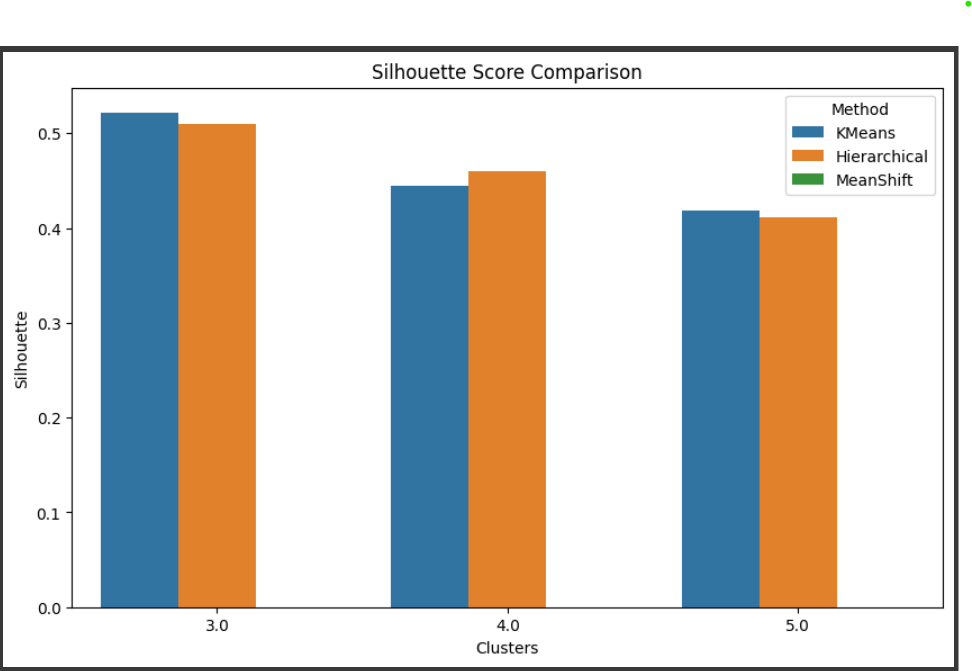

# Clustering-Assignment
# Clustering Analysis

## 1. Overview
This project compares three clustering algorithms—**KMeans**, **Hierarchical Clustering**, and **MeanShift**—on PCA-transformed data. Clustering performance is evaluated using **Silhouette Score**, **Calinski-Harabasz Index**, and **Davies-Bouldin Score**.

---

## 2. Results Table

| Method       | Clusters | Silhouette | Calinski-Harabasz | Davies-Bouldin |
|--------------|----------|------------|-------------------|----------------|
| KMeans       | 3        | 0.522132   | 179.526301        | 0.734652       |
| KMeans       | 4        | 0.444415   | 262.855964        | 0.741625       |
| KMeans       | 5        | 0.418237   | 276.242715        | 0.767693       |
| Hierarchical | 3        | 0.510294   | 283.107423        | 0.707180       |
| Hierarchical | 4        | 0.460304   | 253.908112        | 0.710474       |
| Hierarchical | 5        | 0.411581   | 254.987342        | 0.781780       |
| MeanShift    | N/A      | 0.613037   | 280.124507        | 0.548032       |

---

## 3. Graphical Representation

### Silhouette Score Comparison
The following bar chart illustrates the clustering quality across different algorithms and cluster sizes:

MeanShift achieves the highest silhouette score, indicating the most distinct cluster formation, while KMeans and Hierarchical show decreasing performance as the number of clusters increases.

---

## 4. Key Insights

- **KMeans** performed well with 3 clusters (**Silhouette: 0.5221**), but its performance dropped slightly as the number of clusters increased.
- **Hierarchical Clustering** showed a similar trend, with its best performance at 3 clusters (**Silhouette: 0.5102**).
- **MeanShift** outperformed both methods with the highest **Silhouette Score (0.6130)** and the lowest **Davies-Bouldin Score (0.5480)**, suggesting more compact and well-separated clusters.

---

## 5. Conclusion

- **MeanShift** is the most suitable algorithm for this dataset, as it provides the best clustering quality without requiring pre-defined cluster numbers.
- If a fixed number of clusters is required, **KMeans with 3 clusters** is a good choice, balancing both compactness and separation.
- **Hierarchical Clustering** also performed well but is more suitable for visualizing hierarchical relationships rather than optimizing compactness.

This analysis helps in choosing the right clustering algorithm based on specific dataset requirements and cluster evaluation metrics.
